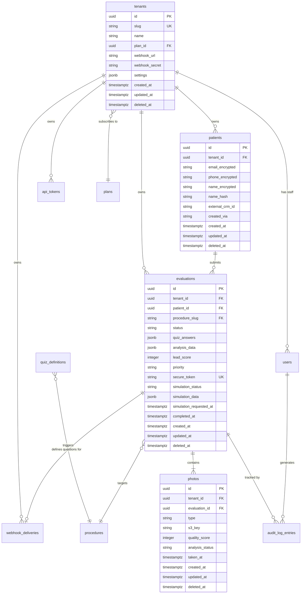

# Database Schema — AestheticAI

> Full schema reference for all PostgreSQL tables. Every table except `tenants` and `plans` uses Row-Level Security (RLS) enforced at the database layer in addition to the Eloquent `HasTenantScope` global scope.
>
> See [erd.mermaid](./diagrams/erd.mermaid) for the entity-relationship diagram.

---

## Conventions

| Convention | Rule |
|-----------|------|
| Primary keys | `uuid` for patient-facing tables, `bigserial` for internal/log tables |
| Tenant scoping | Every table (except `tenants`, `plans`) has a non-nullable `tenant_id uuid` FK |
| Soft deletes | All mutable tables include `deleted_at timestamptz` (nullable) |
| PHI columns | Marked with `🔒 PHI` — these use AES-256-GCM encrypted casts at the application layer |
| Timestamps | All tables have `created_at` and `updated_at` (except `audit_log_entries` — immutable, no `updated_at`) |
| JSONB | Used for flexible clinical data that varies per procedure (quiz answers, AI scores) |

---

## Entity Relationship Diagram



---

## Tables

---

### `tenants`

Represents a clinic (SaaS tenant). The root entity for all tenant-scoped data.

```sql
CREATE TABLE tenants (
    id              uuid PRIMARY KEY DEFAULT gen_random_uuid(),
    slug            varchar(63) NOT NULL UNIQUE,          -- subdomain identifier
    name            varchar(255) NOT NULL,                -- display name
    plan_id         uuid NOT NULL REFERENCES plans(id),
    webhook_url     varchar(2048),                        -- CRM webhook target
    webhook_secret  varchar(64),                          -- HMAC-SHA256 signing key
    settings        jsonb NOT NULL DEFAULT '{}',          -- theme, logo URL, custom copy
    created_at      timestamptz NOT NULL DEFAULT now(),
    updated_at      timestamptz NOT NULL DEFAULT now(),
    deleted_at      timestamptz
);

CREATE INDEX idx_tenants_slug ON tenants(slug) WHERE deleted_at IS NULL;
```

**`settings` JSONB structure:**
```json
{
  "theme": "luxury-dark",
  "logo_url": "https://cdn.../logo.png",
  "primary_color": "#C9A84C",
  "custom_cta": "Start Your Journey",
  "coordinator_emails": ["coord@clinic.com"],
  "procedures_enabled": ["rhinoplasty", "bbl"]
}
```

---

### `plans`

Subscription tier definitions. Managed by AestheticAI admin — not tenant-editable.

```sql
CREATE TABLE plans (
    id                  uuid PRIMARY KEY DEFAULT gen_random_uuid(),
    name                varchar(64) NOT NULL,                -- 'Starter', 'Growth', 'Pro'
    slug                varchar(32) NOT NULL UNIQUE,
    max_procedures      integer NOT NULL DEFAULT 1,
    max_evaluations_mo  integer,                             -- NULL = unlimited
    stripe_price_id     varchar(64),
    features            jsonb NOT NULL DEFAULT '{}',
    created_at          timestamptz NOT NULL DEFAULT now(),
    updated_at          timestamptz NOT NULL DEFAULT now()
);
```

---

### `users`

Clinic staff accounts (coordinators, surgeons, admins, owners). Scoped to a tenant.

```sql
CREATE TABLE users (
    id              uuid PRIMARY KEY DEFAULT gen_random_uuid(),
    tenant_id       uuid NOT NULL REFERENCES tenants(id),
    email           varchar(255) NOT NULL,              -- 🔒 PHI (staff email)
    name            varchar(255) NOT NULL,
    role            varchar(32) NOT NULL,               -- owner|admin|coordinator|surgeon|viewer
    password_hash   varchar(255) NOT NULL,
    totp_secret     varchar(64),                        -- encrypted, nullable = TOTP disabled
    last_login_at   timestamptz,
    created_at      timestamptz NOT NULL DEFAULT now(),
    updated_at      timestamptz NOT NULL DEFAULT now(),
    deleted_at      timestamptz,

    CONSTRAINT users_role_check CHECK (
        role IN ('owner', 'admin', 'coordinator', 'surgeon', 'viewer')
    )
);

CREATE UNIQUE INDEX idx_users_email_tenant ON users(tenant_id, lower(email)) WHERE deleted_at IS NULL;
CREATE INDEX idx_users_tenant ON users(tenant_id) WHERE deleted_at IS NULL;

-- RLS
ALTER TABLE users ENABLE ROW LEVEL SECURITY;
CREATE POLICY tenant_isolation ON users
    USING (tenant_id = current_setting('app.current_tenant_id')::uuid);
```

---

### `patients`

Patient identity records. PHI columns are AES-256-GCM encrypted at the application layer.

```sql
CREATE TABLE patients (
    id              uuid PRIMARY KEY DEFAULT gen_random_uuid(),
    tenant_id       uuid NOT NULL REFERENCES tenants(id),
    name_encrypted  text,                               -- 🔒 PHI: AES-256-GCM
    email_encrypted text NOT NULL,                      -- 🔒 PHI: AES-256-GCM
    phone_encrypted text,                               -- 🔒 PHI: AES-256-GCM
    dob_encrypted   text,                               -- 🔒 PHI: AES-256-GCM
    name_hash       varchar(64),                        -- HMAC hash for deduplication only
    email_hash      varchar(64) NOT NULL,               -- HMAC hash for dedup/search
    external_crm_id varchar(128),                       -- ID in clinic's existing CRM
    created_via     varchar(32) NOT NULL DEFAULT 'widget', -- widget|import|api
    created_at      timestamptz NOT NULL DEFAULT now(),
    updated_at      timestamptz NOT NULL DEFAULT now(),
    deleted_at      timestamptz
);

CREATE INDEX idx_patients_tenant ON patients(tenant_id) WHERE deleted_at IS NULL;
CREATE INDEX idx_patients_email_hash ON patients(tenant_id, email_hash);
CREATE INDEX idx_patients_external_crm ON patients(tenant_id, external_crm_id) WHERE external_crm_id IS NOT NULL;

-- RLS
ALTER TABLE patients ENABLE ROW LEVEL SECURITY;
CREATE POLICY tenant_isolation ON patients
    USING (tenant_id = current_setting('app.current_tenant_id')::uuid);
```

> **Deduplication:** When a patient submits a new evaluation, `email_hash` is checked for a match within the tenant before creating a new `patients` row. Existing patients get a new `evaluations` row linked to their existing record.

---

### `procedures`

Master list of supported procedures. Defines what quizzes and photo protocols are available.

```sql
CREATE TABLE procedures (
    slug            varchar(64) PRIMARY KEY,            -- 'rhinoplasty', 'bbl', etc.
    label           varchar(128) NOT NULL,
    category        varchar(32) NOT NULL,               -- 'face' | 'body'
    photo_protocol  jsonb NOT NULL DEFAULT '[]',        -- required photo angles
    active          boolean NOT NULL DEFAULT true,
    created_at      timestamptz NOT NULL DEFAULT now(),
    updated_at      timestamptz NOT NULL DEFAULT now()
);
```

**`photo_protocol` example:**
```json
[
  { "type": "front", "required": true, "guide_label": "Face forward, neutral expression" },
  { "type": "left_profile", "required": true, "guide_label": "Turn left 90°" },
  { "type": "right_profile", "required": true, "guide_label": "Turn right 90°" }
]
```

---

### `quiz_definitions`

JSON-defined quiz branching logic per procedure. Loaded by the quiz engine at runtime.

```sql
CREATE TABLE quiz_definitions (
    id              uuid PRIMARY KEY DEFAULT gen_random_uuid(),
    procedure_slug  varchar(64) NOT NULL REFERENCES procedures(slug),
    version         integer NOT NULL DEFAULT 1,
    questions       jsonb NOT NULL,                     -- full branching definition
    is_active       boolean NOT NULL DEFAULT true,
    created_at      timestamptz NOT NULL DEFAULT now(),
    updated_at      timestamptz NOT NULL DEFAULT now()
);

CREATE UNIQUE INDEX idx_quiz_def_procedure_active
    ON quiz_definitions(procedure_slug) WHERE is_active = true;
```

**`questions` JSONB structure (abbreviated):**
```json
[
  {
    "id": "q_concerns",
    "type": "multiselect",
    "label": "Which concerns are you looking to address?",
    "options": ["tip", "bridge", "nostrils", "asymmetry"],
    "branches": {}
  },
  {
    "id": "q_prior_surgery",
    "type": "boolean",
    "label": "Have you had a previous rhinoplasty?",
    "branches": {
      "true": { "next": "q_prior_details" },
      "false": { "next": "q_breathing" }
    }
  }
]
```

---

### `evaluations`

Core table. One row per patient evaluation submission.

```sql
CREATE TABLE evaluations (
    id                  uuid PRIMARY KEY DEFAULT gen_random_uuid(),
    tenant_id           uuid NOT NULL REFERENCES tenants(id),
    patient_id          uuid NOT NULL REFERENCES patients(id),
    procedure_slug      varchar(64) NOT NULL REFERENCES procedures(slug),
    status              varchar(32) NOT NULL DEFAULT 'draft',
    quiz_answers        jsonb NOT NULL DEFAULT '{}',    -- all intake responses
    analysis_data       jsonb NOT NULL DEFAULT '{}',    -- AI pipeline output
    lead_score          smallint,                       -- 0–100, null until analysis complete
    priority            varchar(16),                    -- urgent|high|medium|standard
    secure_token            varchar(64) NOT NULL UNIQUE,    -- SHA-256 random, used in magic links + simulation share
    simulation_status       varchar(16),                    -- null|pending|processing|complete|failed
    simulation_data         jsonb,                          -- prompt metadata, placeholder_message, etc.
    simulation_requested_at timestamptz,                    -- when GenerateSimulationJob was dispatched
    coordinator_notes   text,
    follow_up_at        timestamptz,
    external_id         varchar(128),                   -- CRM reference after sync
    completed_at        timestamptz,
    created_at          timestamptz NOT NULL DEFAULT now(),
    updated_at          timestamptz NOT NULL DEFAULT now(),
    deleted_at          timestamptz,

    CONSTRAINT evaluations_status_check CHECK (
        status IN ('draft','submitted','analyzing','complete','contacted','booked','no_show','not_a_fit','failed')
    ),
    CONSTRAINT evaluations_priority_check CHECK (
        priority IN ('urgent','high','medium','standard') OR priority IS NULL
    ),
    CONSTRAINT evaluations_lead_score_check CHECK (
        lead_score BETWEEN 0 AND 100 OR lead_score IS NULL
    )
);

CREATE INDEX idx_evaluations_tenant ON evaluations(tenant_id) WHERE deleted_at IS NULL;
CREATE INDEX idx_evaluations_patient ON evaluations(patient_id);
CREATE INDEX idx_evaluations_status ON evaluations(tenant_id, status) WHERE deleted_at IS NULL;
CREATE INDEX idx_evaluations_priority ON evaluations(tenant_id, priority, lead_score DESC) WHERE deleted_at IS NULL;
CREATE INDEX idx_evaluations_token ON evaluations(secure_token);
CREATE INDEX idx_evaluations_created ON evaluations(tenant_id, created_at DESC) WHERE deleted_at IS NULL;

-- RLS
ALTER TABLE evaluations ENABLE ROW LEVEL SECURITY;
CREATE POLICY tenant_isolation ON evaluations
    USING (tenant_id = current_setting('app.current_tenant_id')::uuid);
```

**`analysis_data` JSONB structure:**
```json
{
  "model_version": "rekognition-v2.1",
  "analyzed_at": "2025-06-15T14:45:00Z",
  "landmarks": { "left_eye": [x, y], "right_eye": [x, y], "...": "27 points" },
  "proportions": {
    "facial_thirds": { "upper": 0.34, "middle": 0.33, "lower": 0.33 },
    "facial_fifths": { "..." : "..." },
    "symmetry_score": 78,
    "golden_ratio_deviation": 0.08
  },
  "recommendations": [
    { "procedure": "rhinoplasty", "match_score": 94, "reasoning": "..." }
  ]
}
```

---

### `photos`

Patient photos associated with evaluations. Stored in S3; this table tracks metadata only.

```sql
CREATE TABLE photos (
    id                  uuid PRIMARY KEY DEFAULT gen_random_uuid(),
    tenant_id           uuid NOT NULL REFERENCES tenants(id),
    evaluation_id       uuid NOT NULL REFERENCES evaluations(id),
    type                varchar(32) NOT NULL,           -- front|left_profile|right_profile|additional
    s3_key              varchar(512) NOT NULL,          -- 🔒 PHI: encrypted path in S3
    s3_key_hash         varchar(64) NOT NULL,           -- HMAC hash for integrity check
    quality_score       smallint,                       -- 0–100 from validation job
    analysis_status     varchar(32) NOT NULL DEFAULT 'pending',
    capture_metadata    jsonb,                          -- device, orientation, lighting estimate
    taken_at            timestamptz,
    created_at          timestamptz NOT NULL DEFAULT now(),
    updated_at          timestamptz NOT NULL DEFAULT now(),
    deleted_at          timestamptz,

    CONSTRAINT photos_type_check CHECK (
        type IN ('front', 'left_profile', 'right_profile', 'additional')
    ),
    CONSTRAINT photos_analysis_status_check CHECK (
        analysis_status IN ('pending', 'processing', 'complete', 'failed', 'skipped')
    )
);

CREATE INDEX idx_photos_evaluation ON photos(evaluation_id) WHERE deleted_at IS NULL;
CREATE INDEX idx_photos_tenant ON photos(tenant_id) WHERE deleted_at IS NULL;

-- RLS
ALTER TABLE photos ENABLE ROW LEVEL SECURITY;
CREATE POLICY tenant_isolation ON photos
    USING (tenant_id = current_setting('app.current_tenant_id')::uuid);
```

**S3 key format:** `{tenant_id}/{patient_id}/{evaluation_id}/{type}_{timestamp}.jpg`

---

### `audit_log_entries`

Append-only, immutable log of all PHI access and state changes. Never deleted, never updated.

```sql
CREATE TABLE audit_log_entries (
    id              bigserial PRIMARY KEY,
    tenant_id       uuid NOT NULL REFERENCES tenants(id),
    user_id         uuid REFERENCES users(id),          -- NULL for patient/system actions
    action          varchar(128) NOT NULL,               -- e.g., 'evaluation.photos.viewed'
    subject_type    varchar(64),                         -- 'Evaluation', 'Patient', etc.
    subject_id      uuid,
    metadata        jsonb NOT NULL DEFAULT '{}',         -- safe context (no PHI)
    ip_address      inet,
    user_agent      text,
    created_at      timestamptz NOT NULL DEFAULT now()
    -- NO updated_at: this table is immutable
);

CREATE INDEX idx_audit_tenant_created ON audit_log_entries(tenant_id, created_at DESC);
CREATE INDEX idx_audit_subject ON audit_log_entries(subject_type, subject_id);
CREATE INDEX idx_audit_user ON audit_log_entries(user_id) WHERE user_id IS NOT NULL;

-- RLS (read-only for tenant users; write via service role only)
ALTER TABLE audit_log_entries ENABLE ROW LEVEL SECURITY;
CREATE POLICY tenant_isolation ON audit_log_entries
    USING (tenant_id = current_setting('app.current_tenant_id')::uuid);
```

**Action namespace conventions:**
```
evaluation.created
evaluation.submitted
evaluation.analysis.complete
evaluation.status.changed
evaluation.photos.viewed          -- PHI access
evaluation.brief.downloaded       -- PHI access
patient.profile.viewed            -- PHI access
coordinator.portal.accessed
coordinator.logged_in
coordinator.logged_out
api_token.used
webhook.delivered
webhook.failed
```

---

### `webhook_deliveries`

Tracks outbound webhook delivery attempts to clinic CRM endpoints.

```sql
CREATE TABLE webhook_deliveries (
    id              uuid PRIMARY KEY DEFAULT gen_random_uuid(),
    tenant_id       uuid NOT NULL REFERENCES tenants(id),
    evaluation_id   uuid REFERENCES evaluations(id),
    event           varchar(64) NOT NULL,
    payload         jsonb NOT NULL,                     -- payload sent (no PHI)
    status          varchar(16) NOT NULL DEFAULT 'pending',
    attempt_count   smallint NOT NULL DEFAULT 0,
    next_retry_at   timestamptz,
    last_response   jsonb,                              -- {status_code, body, latency_ms}
    delivered_at    timestamptz,
    created_at      timestamptz NOT NULL DEFAULT now(),
    updated_at      timestamptz NOT NULL DEFAULT now(),

    CONSTRAINT webhook_deliveries_status_check CHECK (
        status IN ('pending', 'delivered', 'failed', 'retrying')
    )
);

CREATE INDEX idx_webhook_tenant_status ON webhook_deliveries(tenant_id, status) WHERE status IN ('pending','retrying');
CREATE INDEX idx_webhook_next_retry ON webhook_deliveries(next_retry_at) WHERE status = 'retrying';

-- RLS
ALTER TABLE webhook_deliveries ENABLE ROW LEVEL SECURITY;
CREATE POLICY tenant_isolation ON webhook_deliveries
    USING (tenant_id = current_setting('app.current_tenant_id')::uuid);
```

---

### `api_tokens`

Bearer tokens for the External REST API v1.

```sql
CREATE TABLE api_tokens (
    id              uuid PRIMARY KEY DEFAULT gen_random_uuid(),
    tenant_id       uuid NOT NULL REFERENCES tenants(id),
    name            varchar(128) NOT NULL,
    token_hash      varchar(64) NOT NULL UNIQUE,        -- SHA-256 hash; raw token shown once
    scopes          text[] NOT NULL DEFAULT '{}',
    last_used_at    timestamptz,
    expires_at      timestamptz,                        -- NULL = no expiry
    created_by      uuid REFERENCES users(id),
    revoked_at      timestamptz,
    created_at      timestamptz NOT NULL DEFAULT now(),
    updated_at      timestamptz NOT NULL DEFAULT now()
);

CREATE INDEX idx_api_tokens_hash ON api_tokens(token_hash) WHERE revoked_at IS NULL;
CREATE INDEX idx_api_tokens_tenant ON api_tokens(tenant_id) WHERE revoked_at IS NULL;
```

---

### `magic_links`

One-time coordinator portal access tokens sent in evaluation notification emails.

```sql
CREATE TABLE magic_links (
    id              uuid PRIMARY KEY DEFAULT gen_random_uuid(),
    tenant_id       uuid NOT NULL REFERENCES tenants(id),
    evaluation_id   uuid NOT NULL REFERENCES evaluations(id),
    token_hash      varchar(64) NOT NULL UNIQUE,        -- SHA-256 hash; never stored raw
    used_at         timestamptz,                        -- NULL = not yet used
    expires_at      timestamptz NOT NULL,               -- typically 15 minutes
    created_at      timestamptz NOT NULL DEFAULT now()
);

CREATE INDEX idx_magic_links_token ON magic_links(token_hash) WHERE used_at IS NULL;
CREATE INDEX idx_magic_links_expire ON magic_links(expires_at) WHERE used_at IS NULL;
```

---

## Row-Level Security — Setup Procedure

RLS is enabled on every tenant-scoped table. The application sets the tenant context once per request:

```sql
-- Called by TenantContext service at the start of every request
SET LOCAL app.current_tenant_id = 'resolved-tenant-uuid-here';
```

**Enabling RLS on a new table (required pattern):**
```sql
ALTER TABLE {table_name} ENABLE ROW LEVEL SECURITY;
ALTER TABLE {table_name} FORCE ROW LEVEL SECURITY;  -- Applies even to table owner role

CREATE POLICY tenant_isolation ON {table_name}
    FOR ALL
    USING (tenant_id = current_setting('app.current_tenant_id', true)::uuid);
```

The second argument `true` in `current_setting` prevents an error if the setting hasn't been applied — it returns NULL instead, which means the USING clause evaluates to false and no rows are returned. This is the safe-fail behavior.

---

## Migration Checklist

When creating a new table, verify:

- [ ] Has `tenant_id uuid NOT NULL REFERENCES tenants(id)` (unless it's a global lookup table)
- [ ] Has `created_at`, `updated_at` timestamps
- [ ] Has `deleted_at` for soft deletes (unless append-only like `audit_log_entries`)
- [ ] PHI columns are noted with a comment and use encrypted casts in the model
- [ ] RLS policy created and enabled
- [ ] `FORCE ROW LEVEL SECURITY` applied (catches application-role bypasses)
- [ ] Indexes created for `tenant_id`, all FK columns, and all `WHERE` columns used in queries
- [ ] Rollback migration included (drop indexes → drop table)
