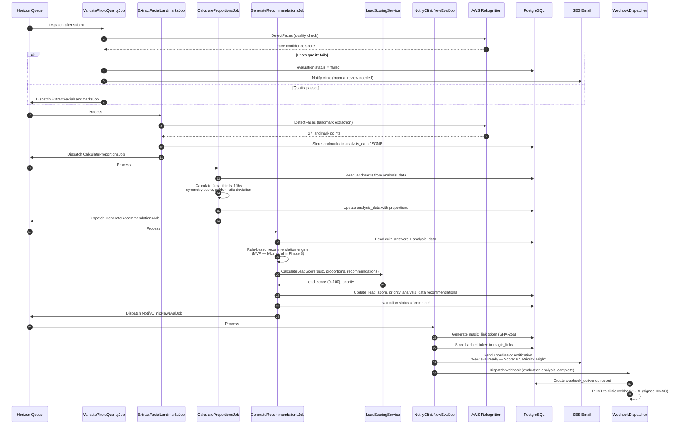
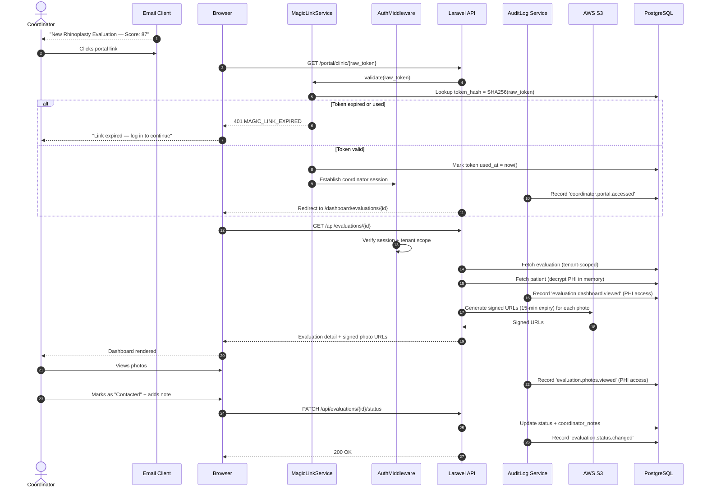
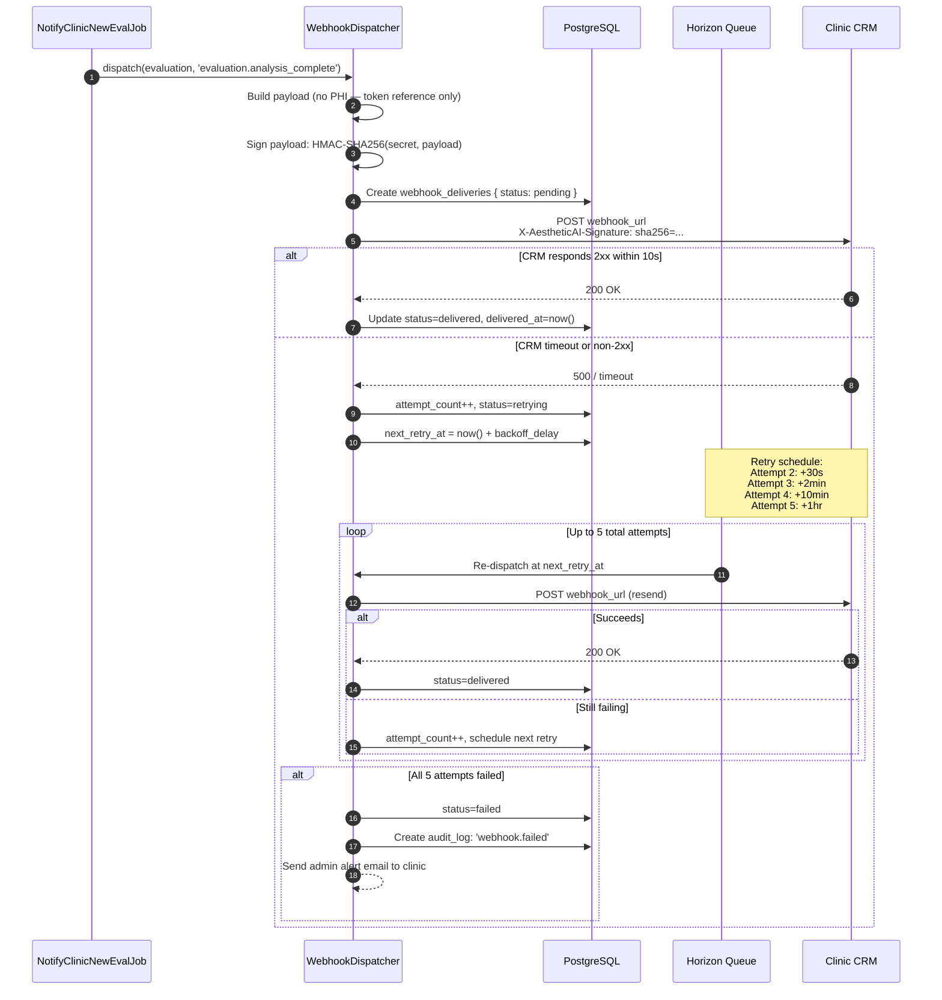
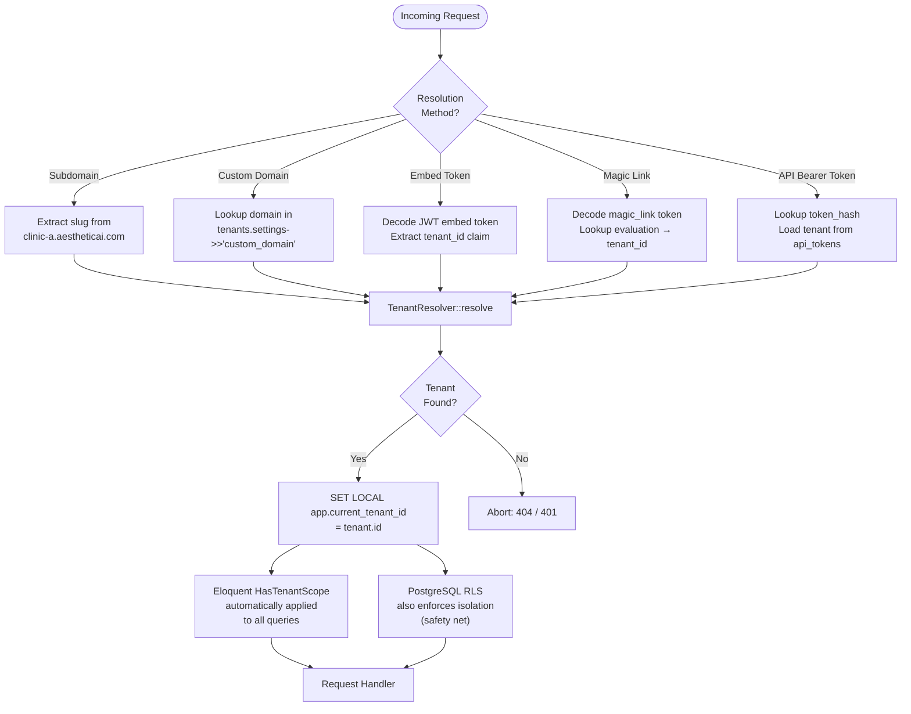
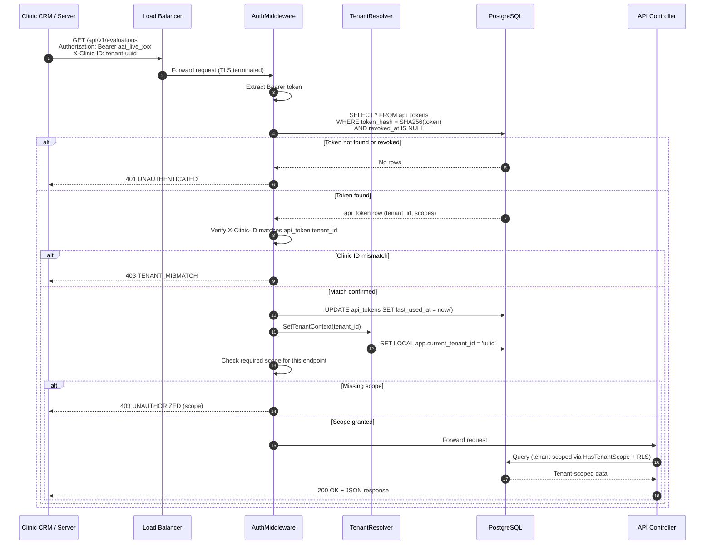

# Sequence Diagrams — AestheticAI

> Key system flows illustrated as sequence diagrams. Standalone `.mermaid` files for each diagram are in [`diagrams/`](./diagrams/).

---

## Table of Contents

1. [Patient Intake Flow](#1-patient-intake-flow)
2. [AI Processing Pipeline](#2-ai-processing-pipeline)
3. [Coordinator Views Lead (Magic Link)](#3-coordinator-views-lead--magic-link)
4. [Webhook Delivery & Retry](#4-webhook-delivery--retry)
5. [Tenant Resolution (Embed Widget)](#5-tenant-resolution--embed-widget)
6. [External API Authentication](#6-external-api-authentication)

---

## 1. Patient Intake Flow

Full journey from widget load to evaluation submission. Photos are uploaded during the wizard; the final submit dispatches the AI pipeline.

```mermaid
sequenceDiagram
    autonumber

    actor Patient
    participant Widget as Embed Widget<br/>(Browser)
    participant API as Laravel API
    participant S3 as AWS S3
    participant Queue as Horizon Queue

    Patient->>Widget: Opens clinic page with widget
    Widget->>API: GET /embed/{clinic_slug}
    API-->>Widget: Clinic config (theme, procedures)

    Patient->>Widget: Selects procedure (Rhinoplasty)
    Widget->>API: POST /api/evaluations
    note right of API: Creates draft evaluation<br/>Returns secure token
    API-->>Widget: { evaluation_token }

    loop For each quiz step
        Patient->>Widget: Answers question(s)
        Widget->>API: POST /api/evaluations/{token}/quiz
        API-->>Widget: { next_step, progress }
    end

    rect rgb(20, 40, 60)
        note over Patient,S3: Photo Capture Step
        Patient->>Widget: Grants camera permission
        Widget->>Widget: MediaPipe quality check<br/>(client-side, no upload)

        loop For each photo (front, left, right)
            Patient->>Widget: Captures photo
            Widget->>Widget: Blur + angle validation
            Widget->>API: POST /api/evaluations/{token}/photos<br/>(multipart)
            API->>API: Server-side quality check<br/>(Rekognition face detection)
            API->>S3: Store encrypted (KMS)
            S3-->>API: Stored at s3_key
            API-->>Widget: { photo_id, quality_score }
        end
    end

    Patient->>Widget: Enters name, email, phone
    Patient->>Widget: Accepts HIPAA consent
    Widget->>API: POST /api/evaluations/{token}/submit
    API->>API: Encrypt PHI columns
    API->>Queue: Dispatch AI pipeline jobs
    API-->>Widget: { status: submitted, portal_url }

    Widget-->>Patient: Success screen + portal link
```

---

## 2. AI Processing Pipeline

Asynchronous processing chain after evaluation submission. Each job enqueues the next on success, or marks as failed and alerts on error.

---

## 3. Coordinator Views Lead — Magic Link

Coordinator receives a notification email, clicks the magic link, and accesses the lead detail page.

---

## 4. Webhook Delivery & Retry

Outbound webhook delivery with HMAC signing, exponential backoff retry, and failure notification.

---

## 5. Tenant Resolution — Embed Widget

How the platform identifies which clinic is making a request across the three resolution methods.

---

## 6. External API Authentication

How Bearer token auth works for the REST API v1.

---

*Diagrams last updated: 2026-04. For corrections, edit the corresponding `.mermaid` file in `docs/technical/diagrams/`.*
