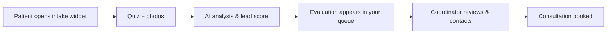

# Getting started

_Last verified: 2026-06-12_

Aesthetic AI is your clinic's digital consultation concierge: patients complete an AI-guided intake (quiz + photos), and your team receives pre-qualified clinical profiles instead of bare contact forms.

## Sign in

1. Open your clinic's Aesthetic AI URL.
2. Sign in with email/password or **Continue with Google**.
3. Coordinators may also receive **magic links** in evaluation notification emails — one click opens the evaluation, no password needed.
4. Privileged accounts are asked to set up **two-factor authentication** — follow the QR-code prompt.

For HIPAA compliance the session locks after inactivity; just sign in again.

## Roles

| Role | Can do |
|------|--------|
| **Owner** | Everything, including billing |
| **Admin** | Everything except billing-sensitive actions reserved for owners |
| **Coordinator** | Work evaluations: status, notes, simulations, consultations, briefs |
| **Surgeon** | View evaluations, download clinical briefs, simulations, consultations |
| **Viewer** | Read-only dashboard and evaluations |

## How an evaluation flows

The patient does the work up front; your job starts when the evaluation lands in the queue — ideally within minutes, while intent is hot.

## Your home base

- **Dashboard** — new today, pending review, booked this week, urgent count, and recent evaluations
- **Evaluations** — the full queue (your main workspace)
- **Analytics** — funnel performance
- **Clinic section** — settings, team, integrations, billing (owner/admin)

A first-run **onboarding checklist** on the dashboard walks new clinics through setup; dismiss it when done.

## Tips

- Speed-to-lead matters most: review **new** evaluations the same day.
- The lead score is a triage hint, not a verdict — high scores first, but don't ignore the rest.
