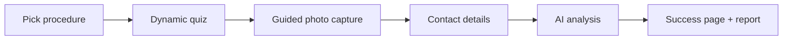

# Intake widget & patient experience

_Last verified: 2026-06-12_

What patients actually see, and how to put the intake wizard on your website.

## Embedding the widget

Your developer adds one script tag to the clinic website (from **Integrations** / API docs):

```html
<script src="https://yourclinic.aesthetic-ai.example/widget.js" async></script>
```

The widget opens the intake wizard on your clinic's subdomain. You can also link patients directly to the intake URL — from ads, Instagram bio, or QR codes.

## What the patient goes through



- **Dynamic quiz** — questions adapt to the procedure (BMI for BBL, skin laxity for facelift…), including universal safety questions.
- **Guided photos** — overlay guides help the patient shoot usable angles on their phone.
- **Beauty roadmap report** — after submitting, the patient can download a personalized PDF report (token-gated, no login).

## Patient portal (status hub)

Each patient gets a tokenized **portal link** where they can check their evaluation status and take next actions (e.g., join a consultation). No password — the link is the credential, so it should only ever be sent to the patient.

## Privacy notes for staff

- Patients are never asked to email photos — everything stays in the encrypted platform.
- Patient-facing links (report, portal, simulation share) are tokenized; don't forward them to anyone but the patient.
- If a patient asks to redo photos, send them the intake link again — a fresh evaluation is cleaner than annotating a bad one.

## Tips

- Put the intake link behind every "Book a consultation" button — it qualifies leads while you sleep.
- Test the wizard yourself on a phone once per quarter; that's how most patients experience it.
