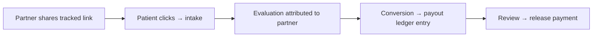

# Affiliates

_Last verified: 2026-06-12_

The affiliate module (when enabled for your clinic) lets influencers and partners drive tracked intake traffic, with automatic attribution and payout management.

## How attribution works

## Partners

**Affiliate Partners**: add a partner, set their terms, and give them their **portal link** (tokenized — rotate it if it leaks). Partners see their own stats and assets in the portal after accepting terms.

## Campaigns & links

**Affiliate Campaigns**: create a campaign, upload creative **assets** for partners to use, and generate **tracked links** (plus short social-friendly links). Every click and resulting evaluation is attributed.

## Payouts

**Affiliate Payouts** is the money queue:

1. Conversions create **ledger entries**.
2. **Review** an entry to verify it's legitimate.
3. **Release** to approve payment per your payout process.

## Fraud queue

Suspicious patterns (click spam, self-referrals, anomalies) land in the **Fraud Queue** instead of payouts:

- **Clear** — false alarm; the entry returns to the normal payout flow.
- **Reject** — confirmed fraud; the entry is voided.

## Affiliate analytics

**Affiliate Analytics** shows per-partner and per-campaign performance — clicks, evaluations, conversions, owed amounts.

## Tips

- Review the fraud queue weekly; stale entries block partner payments.
- Rotate a partner's portal token immediately if they report a leak.
- Give partners fresh campaign assets quarterly — stale creative converts worse.
